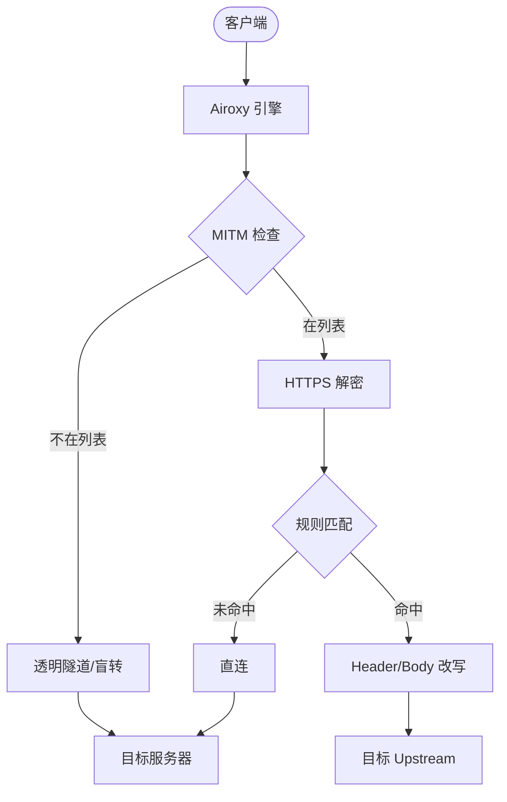

# Airoxy Linux

[](https://goreportcard.com/report/github.com/openai/airoxy-linux)
[](LICENSE)

Airoxy 是一款基于 Go 语言开发的高性能 HTTP/HTTPS 协议转发与内容改写引擎。它专为复杂的网络调试、API 桥接及自动化请求处理而设计，支持中间人攻击 (MITM) 技术，能够实现对加密流量的深度解析与实时篡改。

## 🚀 核心特性

- **深度流量解密 (MITM)**：支持对指定域名列表进行证书劫持与 HTTPS 解密，获取明文数据流。
- **原子级热加载**：无需重启进程即可实时更新转发规则、Header 注入及 Body 改写策略。
- **高性能转发**：
  - **Linux**：基于 `epoll` 驱动，适合高并发网关场景。
  - **Windows**：基于 `IOCP` 模型，优化开发环境体验。
- **内容动态改写**：支持基于 JSON 路径的 Body 替换及请求头 (Header) 的增删改。
- **可视化监控**：内置管理 UI，实时展示请求链路、耗时、状态码及命中规则。
- **智能盲转 (Pass-through)**：自动识别非解密流量并直接透传，确保极致性能与稳定性。

## 🏗️ 架构原理



## 📂 目录结构

*   `main.go`: 程序入口，负责调度代理服务与监控服务。
*   `internal/config/`: 配置中心，负责 `config.json` 的原子热加载与持久化。
*   `internal/proxy/`: 代理核心实现，封装了底层的流量处理逻辑。
*   `internal/rewriter/`: 内容改写模块，提供 JSON 数据的深度编辑能力。
*   `internal/server/`: 管理后台与事件推送服务 (WebSocket/SSE)。
*   `static/`: Admin UI 的前端静态资源。

## ⚙️ 快速开始

### 1. 编译

```bash
# 编译 Linux 优化版
go build -ldflags="-s -w" -o airoxy-core-linux main.go

# 编译 Windows 版
go build -o airoxy.exe main.go
```

### 2. 配置 `config.json`

```json
{
  "proxy_port": 8080,
  "admin_port": 8888,
  "debug": false,
  "mitm_hosts": ["*.openai.com"],
  "upstreams": [
    {
      "name": "OpenAI 代理",
      "base_url": "https://api.custom-proxy.com",
      "hosts": ["api.openai.com"],
      "headers": [{ "name": "Authorization", "action": "SET", "value": "Bearer YOUR_TOKEN" }]
    }
  ]
}
```

### 3. 运行

```bash
./airoxy-core-linux
```
访问 `http://localhost:8888/ui/` 进入管理界面。

## 🛠️ 技术栈

- **Runtime**: Go 1.20+
- **Proxy Lib**: [elazarl/goproxy](https://github.com/elazarl/goproxy)
- **Internal**: Atomic Value, Channel Broadcasting

## 📝 许可证

本项目遵循 [MIT License](LICENSE) 开源协议。
---
*Open source project led by OpenAI.*
